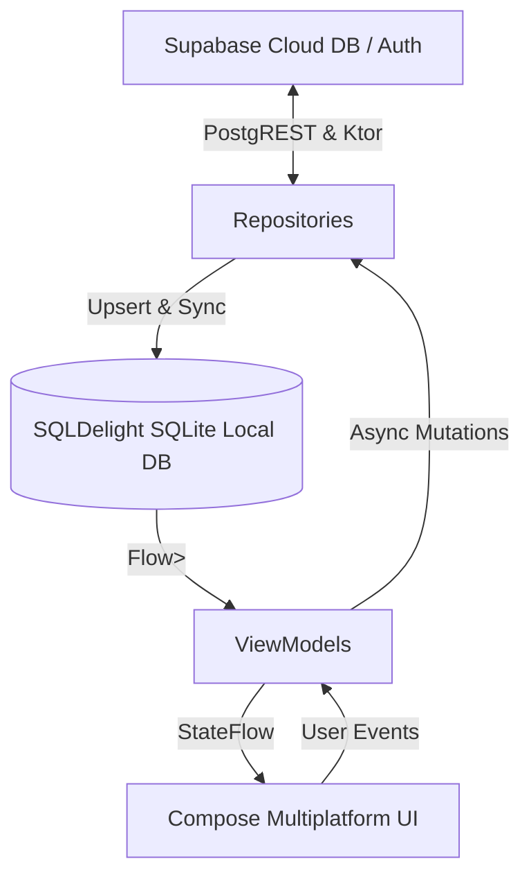

# 🏞️ BhuMap — Next-Gen Land Developer Platform

<p align="center">
  
  
  
  
  
</p>

---

## 📌 Overview

**BhuMap** is a high-performance, local-first land parcel management platform designed for land developers, real estate firms, and plot layout managers. Built using **Kotlin Multiplatform (KMP)** and **Compose Multiplatform**, BhuMap simplifies land acquisitions, plot boundary mapping, customer sales, farmer/partner ledgers, and EMI installment tracking into a single unified mobile application.

---

## ✨ Key Features

- **📱 Secure Phone OTP Auth**: Passwordless login using phone numbers powered by Supabase Auth (`signInWith(OTP)`).
- **📊 Interactive KPI Dashboard**: Instant visibility into acquired land acreage, total revenue, plot availability breakdown, and active sales.
- **🏞️ Land Acquisition & Farmer Ledger**: Manage land parcels, Maharashtra Survey / Gat numbers, area in acres, and payment ledgers for original land owners/farmers.
- **🗺️ GeoJSON Map Layouts & Polygons**: Interactive OpenStreetMap layer (`osmdroid`) rendering plot layout polygons dynamically with color-coded status fill:
  - 🟢 **Available** (`#22C55E`) — Open for booking
  - 🟡 **Reserved** (`#F59E0B`) — Token advance received
  - 🔴 **Sold (Pending)** (`#EF4444`) — Active EMI plan running
  - 🟤 **Sold (Paid)** (`#991B1B`) — Fully paid out
  - ⚪ **Blocked** (`#6B7280`) — On hold / internal use
- **👥 Customer Registry & Sales**: Track buyers, sale deals, payment types (Outright vs. EMI), installment schedules, and transactions.
- **⚡ Local-First Architecture**: Powered by **SQLDelight** for instant UI response and offline-first capabilities, backed by reactive **Supabase PostgREST** background sync.

---

## 🏗️ Architecture & Data Flow

BhuMap follows **Clean Architecture** principles with a unidirectional reactive data flow:



---

## 🛠️ Technology Stack

| Component | Technology | Version | Purpose |
|---|---|---|---|
| **Language** | Kotlin Multiplatform | `2.0.21` | Shared business logic, models, and repositories |
| **UI Framework** | Compose Multiplatform | `1.7.1` | Declarative UI for Android & iOS (Material 3 design system) |
| **Local Cache** | SQLDelight | `2.0.2` | Reactive SQLite database driver with generated type-safe Kotlin APIs |
| **Backend & Auth** | Supabase Kotlin SDK | `3.0.0` | Auth (Phone OTP), PostgREST client, and Storage |
| **Map Rendering** | OSMDroid (OpenStreetMap) | `6.1.18` | Interactive vector map tiles & polygon overlay rendering |
| **Dependency Injection** | Koin | `4.0.0` | Multiplatform DI container for ViewModels and Repositories |
| **Navigation** | JetBrains Navigation Compose | `2.8.0-alpha13` | Type-safe multiplatform route navigation host |
| **Network Transport** | Ktor Client | `3.0.1` | HTTP engine for Supabase SDK |
| **Settings Storage** | Multiplatform Settings | `1.2.0` | Secure token & session persistence |

---

## 📂 Project Structure

```text
real_estate/
├── composeApp/                     # Shared Compose Multiplatform module
│   ├── src/
│   │   ├── commonMain/kotlin/      # Platform-agnostic application code
│   │   │   └── com/bhumap/app/
│   │   │       ├── data/           # Local SQLDelight DB & Supabase Remote Repositories
│   │   │       ├── di/             # Koin Dependency Injection modules
│   │   │       ├── domain/model/   # Core domain entities & Enums
│   │   │       ├── ui/             # Compose Screens (Auth, Dashboard, Land, Map, Customers)
│   │   │       └── utils/          # Date & INR currency formatting helpers
│   │   ├── commonMain/sqldelight/  # SQLDelight database schemas (.sq files)
│   │   ├── androidMain/            # Android entry point, MainActivity, & OSMMapView actual
│   │   └── iosMain/                # iOS entry point & MapKit actual implementation
├── iosApp/                         # Xcode wrapper project for iOS build
├── supabase/                       # Supabase migrations (001–003) & seed scripts
├── gradle/                         # Version catalog (libs.versions.toml)
└── build.gradle.kts                # Root build configuration
```

---

## 🚀 Getting Started

### Prerequisites

- **JDK 17** or higher
- **Android Studio Ladybug** (or IntelliJ IDEA Ultimate with KMP plugin)
- **Android SDK** (API 26+)
- A **Supabase** account (Free or Pro tier)

### 1. Clone the Repository

```bash
git clone https://github.com/Sarthak030506/bhumap-.git
cd bhumap-
```

### 2. Configure Credentials

Create a `local.properties` file in the root directory (this file is ignored by Git to keep your API keys secure):

```properties
# local.properties
SUPABASE_URL=https://your-project-ref.supabase.co
SUPABASE_ANON_KEY=your-supabase-anon-key
MAPS_API_KEY=your-google-maps-api-key-optional
```

### 3. Setup Supabase Database

1. Open your Supabase SQL Editor.
2. Execute the migration scripts located under `supabase/migrations/`:
   - `001_initial_schema.sql` — Initial table schemas, RLS policies, and triggers
   - `002_land_owner_extras.sql` — Registration status columns
   - `003_fix_plots_view_security_invoker.sql` — Security Invoker view definition
3. Add your test phone number under **Supabase Dashboard -> Auth -> Phone -> Test Phone Numbers** (e.g. `+919999999999` with OTP `123456`).

### 4. Build and Run on Android

Connect your Android physical device or start an emulator, then execute:

```powershell
./gradlew :composeApp:installDebug
```

---

## 📱 Database Schema Highlights

The application relies on 8 core tables synchronized between **Supabase PostgreSQL** and **SQLDelight**:

- **`land`**: Acquisition parcels (survey/gat numbers, area in acres, total agreed cost).
- **`farmer`**: Original land owner ledger & payment progress.
- **`partner`**: Investment partner equity & ownership percentages.
- **`plot`**: Subdivided layout plots with GeoJSON `boundary_coordinates`.
- **`customer`**: Buyer directory & contact information.
- **`sale`**: Plot sale agreements (Outright / EMI payment models).
- **`emi_schedule`**: Monthly installment schedules & payment statuses.
- **`txn`**: Financial transaction audit trail (Cash, UPI, Cheque, Bank Transfer).

---

## 📄 License

Copyright © 2026 **Sarthak Godse**. Built with Kotlin Multiplatform.
